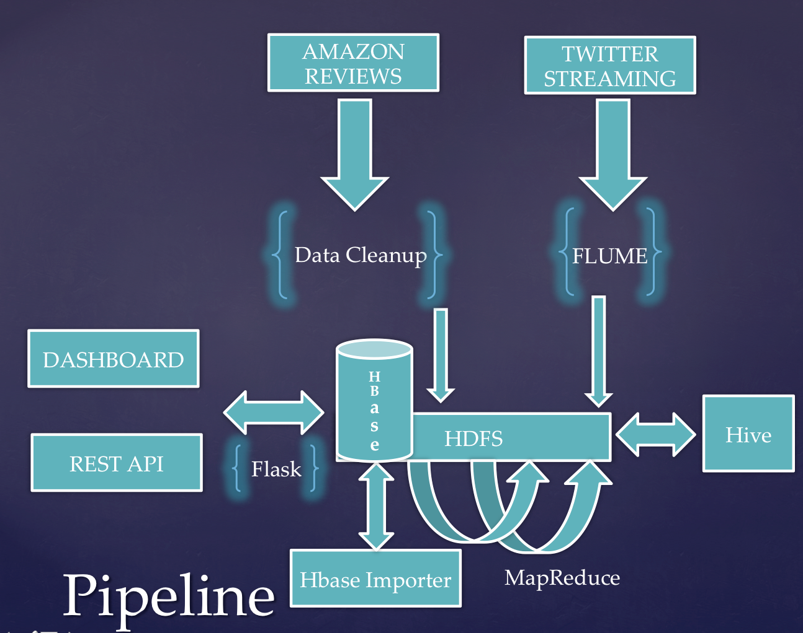

# TweetsMeetReviews

The idea is to get Tweets from Twitter Stream and possibly associate them with the reviews in the system.

User Tweet about a product(e.g Movie), Tweet get streamed by Twitter Streaming API.
Tweets are received on the cluster using Apache Flume and stored in Hadoop HDFS.
The stored Tweets are partitioned hourly and analyzed for possible association 
with a review by a MapReduce job. The processed Tweets are then stored in HBase.

Reviews are loaded in to HBase as well, at the bootstrapping of the application.

REST APIs are built for consuming the results.

Pipeline
-----------------

  
### Data Source
    1. Twitter Stream (Twitter Streaming API)

    2. Amazon Reviews (Snap Dataset)

### Volume, Velocity, and Variety
    1. Volume: Movie Reviews 1 GB(~800,000 records: ~12,000 Unique Movie Titles)
               Tweets processed (~1 Million tweets per day)
    
    2. Velocity: The rate at which the tweets are received from Twitter Streaming API(~20,000-40,000 tweets per hour)
    
    3. Variety: Two different data sources used (1. Tweets 2. Reviews)  

### REST API

    1. Get Tweets (Limited by 100)

    2. Get Tweets from ID (Limited by 100)

    3. Get Reviews for Movie

### Environment Setup
#### CLUSTER:
 
    1. AWS EC2 instances (4 nodes), with Ubuntu OS and Cloudera Hadoop Distribution
    2. A standalone EC2 instance for Webserver with Ubuntu OS. Use setup.txt in server directory to setup webserver.    

##### HBase setup
    1. Look for hbase.ddl.txt in scripts/hbase directory and create tables accordingly.
    
##### Hive setup
    1. Look for hive.ddl.txt in scripts/hive directory and create tables accordingly.
    
#### Exporting Jars
    1. Build a Jar out of this project and move it to the cluster. possibly in a jars directory in user home directory
       if you move it to a different location change the reference scripts accordingly.    

### Bootstrapping the Application (One time)
(Involves: Script to Cleanup data & Importing to HBase)

    1.  Download snap dataset for reviews
    2.  Use reviews.clean.FormatReviews to clean the movie reviews
    3.  Use reviews.clean.GenerateUniqueMovieTitles with previous steps output as input to generate unique movie titles 
    3.  Store the cleaned reviews and unique movie title files generated in previous steps into HDFS.
    4.  Use reviews.export.ReviewsExport to export review into HBase datastore.
    5.  If you want to update movie titles list repeat step 3 & use updatetitles.sh in scripts/bash directory.

### Setup the cluster to receive Tweets (continuously)
(Involves: Flume, HDFS)

    1. Use flume.conf in conf directory as a sample to setup your flume agent.
    2. Create flume user and flume group

### Processing Jobs (Hourly)
(Involves: Hadoop, HDFS, MapReduce, Hive)

    1. Use Hive to partition data for an hour and extract Tweet text
    2. Use MapReduce Job to possibly associate Tweets with Reviews
    3. Step 1 & 2 must be done for every hour

### Storing processed Tweets (Hourly)
(Involves: HDFS, Script to retrieve results and store, HBase)

    1.  Use tweets.export.TweetsExport to export the Tweets to HBase

### Serving the processed result (continuously)
(Involves: Rest API powered by a web server)

### Collecting Metrics (Hourly)
(Involves: Hive, HDFS, Script to retrieve results and store, HBase)

    1.  Hive collects the metrics and hand it over to a script to store it in HBase.
        Use stats.export.StatsExport to export the Metrics to HBase

### Serving the processed result (continuously)
(Involves: Rest API powered by a web server)

 Three REST APIs are published for consuming results
 
    1. Get Tweets (results limited by 100)
    2. Get Tweets from ID (Tweets from that ID is given, results limited by 100)
    3. Get Reviews for a Movie (Fetches all the reviews for the movie) 

### DRY - making life easier... (CronJob)
    For convenience a script has been created which does all the above steps chained together.
    Also, the script is set in the crontab to run for every hour. Look for crontab.conf in conf/crontab.conf
    Look for tweetprocessor.sh in scripts/bash directory. This script can also be invoked as required.
    
### Testing the application
    Used JUnit & Jmeter to test my some of my components. 
    To Run the tests update path constants located at test directory reviews.clean package